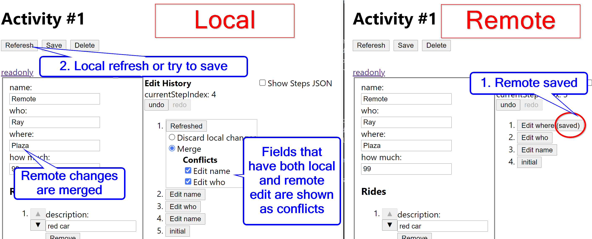
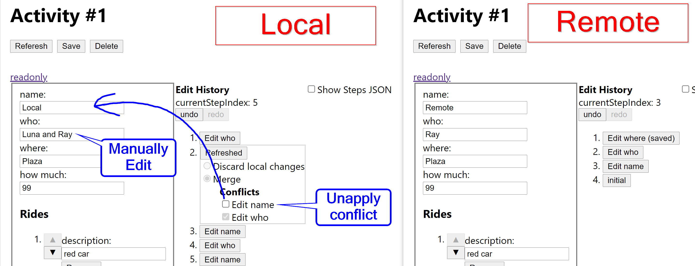
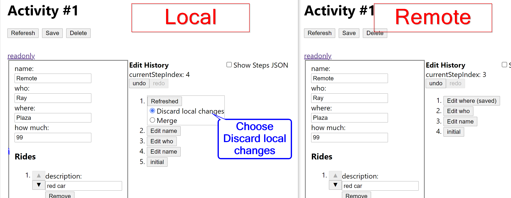
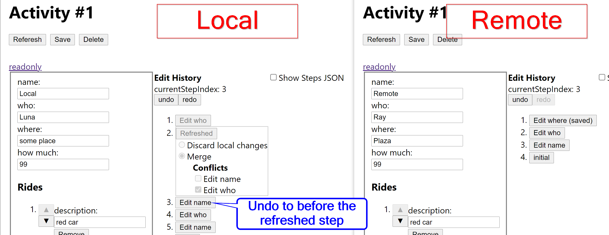
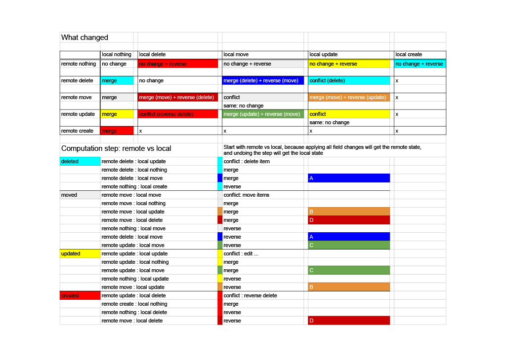

# Edit History

* [Key concepts](#key-concepts)
  + [Version Token](#version-token)
  + [Path](#path)
  + [Field Change](#field-change)
  + [Combined Field Change](#combined-field-change)
  + [Grouped Field Changes](#grouped-field-changes)
  + [Step](#step)
  + [Operation](#operation)
  + [Conflict](#conflict)
  + [Related Change](#related-change)
  + [Edit Steps](#edit-steps)
  + [Refreshed Step](#refreshed-step)
  + [Use of immer](#use-of-immer)
* [Concurrency handling](#concurrency-handling)
  + [Example: merge changes](#example--merge-changes)
  + [Example: merge changes with conflict resolution](#example--merge-changes-with-conflict-resolution)
  + [Example: discard local changes](#example--discard-local-changes)
  + [Example: use local](#example--use-local)
* [Edit patterns](#edit-patterns)

## Key concepts

### Version Token
Token for a specific version. If data is saved, version token changes, therefore can detect change by comparing the version tokens.

### Path
Json Pointers-like, starts with `/`. e.g. `/who`.

### Field Change

Records a change of value in path's location.
Can undo and redo each field change.

### Combined Field Change
If the a field's value changes consecutively, it will count as one field change. It is implemented by combining the new change with the last field change. `combineFieldChanges`

### Grouped Field Changes
Field changes of different paths, that are inseparable. The changes will undo or redo together, and apply or unapply together.

### Step
Related and consecutive field changes will count as one step. One step can have one field change, or multiple field changes. It is implemented my merging the new change with the last step. `calculateSteps`

If a step has `versionToken`, the step is a "Refreshed" step. `mergeBehaviour` can either be `merge` or `discard local changes`.

When `mergeBehaviour` is `merge`, operations with type `merge`, and `conflict` with `conflictApplied=true` are applied, operations with type `reverse local` are not applied.

When `mergeBehaviour` is `discard local changes`, all operation types `merge`, `conflict` and `reverse local` are applied. The result formData will be the remote's formData.

`saveStatus` shows that the formData at that step is saved by the user, and that step will not merge with later changes. `saveStatus` is not reliable, and is intended only for giving the user a hint.

### Operation
type: 'edit' | 'merge' | 'conflict' | 'reverse local'
fieldChanges
applied: all field changes must be applied or unapplied together

Operartions in a step are ordered

An edit step will have only one operation, that operation can have one or more field changes

### Conflict
A conflict is a special kind of Operation. It has a name, similar to step name. It contains one or more field changes. When the step's `mergeBehaviour` is `merge`, the user can choose to apply or unapply the conflict with a checkbox. Apply a conflict means take remote's version of the data, unapply means take the local version.

When the field(or related fields) are edited after the "Refreshed" step, the option to apply or unapply a conflict will be disabled.

### Related Change
A conflict's apply or reapply will be disabled when there is a change that relates to any of the conflict's field changes.

### Edit Step
All Redux Actions that chould change formData will have editHistory middleware calculate the step. See `editStep.ts`.

### Refreshed Step
For action `setActivityFromAppStore`, the App's formData might merge with the local formData with a step named `Refreshed`. See `refreshedStep.ts`.

### Use of immer
`undoFieldChange` and `redoFieldChange` uses immer to calculate new formData. `produce` is called for each field change, because there can be replacements of an object properties (collection add) and the new part is not drafted.

## Concurrency handling

### Example: merge changes
When user click refresh or try to save, but there is remote changes, a new 'Refershed' step might be added, and the remote's form data is merged with the local changes. e.g.

### Example: merge changes with conflict resolution
Choose to apply or unapply a conflict with the checkbox.
Manually edit if neither remote or local is wanted.

### Example: discard local changes
Choose to use the entire remote form data with 'Discard local changes' option.

### Example: use local
Choose to use the entire local form data by undoing the refreshed step.

## Edit patterns
Check `editHistory.test.js`
- Edit field
- Remove item from collection
- Move items in collection
- Edit collection's item's field
- Add item to collection

Refresh Collection Operations
